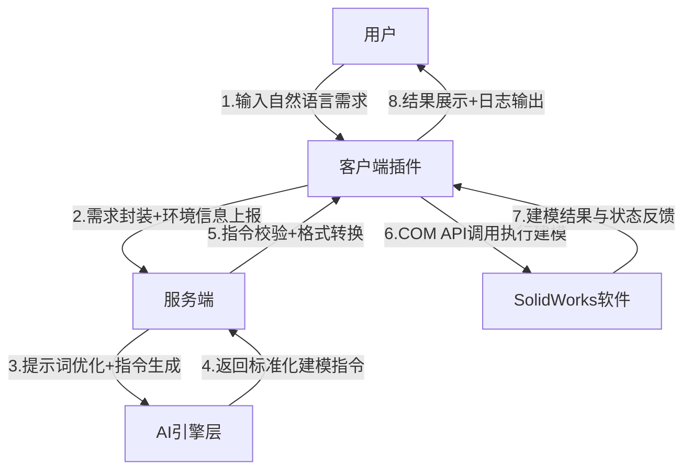

# Vulcan：基于SolidWorks的AI智能建模助手——2026年“智创未来”AI智能体大赛命题七参赛说明文档
## 文档版本
## 一、项目概述
### 1.1 项目名称
Vulcan：AI驱动的SolidWorks智能建模助手

### 1.2 项目定位
针对工程设计领域三维建模“学习成本高、操作流程繁、重复工作多”的核心痛点，Vulcan以**自然语言交互为入口、AI指令生成为核心、SolidWorks深度适配为基础**，打造轻量化、零门槛的智能建模工具。无需专业建模知识，用户仅通过文本描述即可自动生成符合工程标准的3D模型，大幅降低建模门槛，提升设计效率，适配学生、初级设计师及非专业用户的快速原型开发需求。

### 1.3 适配命题
华中科技大学2026年“智创未来”创意AI智能体校园开发大赛——**命题七：工程设计类AI智能体开发**，聚焦“AI+工程软件”融合，实现自动化建模、智能辅助设计等高价值场景

### 1.4 个人开发说明
本项目由个人独立完成，涵盖需求分析、架构设计、全栈开发（客户端+服务端）、AI算法优化、测试验证全流程。通过模块化设计和技术栈合理选型，实现了复杂功能的轻量化落地。

## 二、命题理解与需求分析
### 2.1 命题核心要求深度解读
结合大赛宗旨与命题七导向，核心需满足“**智能性、实用性、技术可行性**”三大核心维度：
1. **智能性**：具备“自然语言输入→AI推理规划→自动化执行”的端到端能力，无需人工介入中间环节；
2. **实用性**：聚焦真实工程设计场景，解决建模效率低、学习成本高等痛点。
3. **技术可行性**：架构设计合理，代码质量可靠，支持本地部署与实际运行，提供可验证的Demo。

### 2.2 目标用户与场景细分
| 目标用户 | 核心场景 | 具体需求 | 痛点解决方案 |
|----------|----------|----------|--------------|
| 工程专业学生 | 课程设计、竞赛建模、毕业设计 | 快速生成基础零件、验证设计方案、降低建模学习成本 | 自然语言交互，无需SolidWorks操作基础，10分钟上手 |
| 初级机械设计师 | 常规零件建模、多版本方案迭代 | 减少重复操作、提升建模效率、保证尺寸准确性 | 自动化特征执行，参数可预先调整，避免人工误差 |
| 非专业设计人员（如产品经理、创业者） | 产品原型可视化、需求快速呈现 | 无建模基础即可生成简单结构，无需依赖设计师 | 零门槛文本输入，自动完成全流程建模，支持格式导出 |

### 2.3 需求清单
| 需求类型 | 具体描述 | 技术指标 | 实现方式 |
|----------|----------|----------|----------|
| 核心功能需求 | 自然语言识别建模需求 | 支持中文输入，识别准确率高 | 领域术语库+提示词工程+LLM指令生成 |
| 核心功能需求 | 草图自动生成 | 支持矩形、圆形、槽口、圆弧等6种常见草图 | SolidWorks COM API+坐标自动计算 |
| 核心功能需求 | 特征自动执行 | 支持拉伸、切除（完全贯穿/指定深度）、圆角、倒角 | 特征参数标准化+API适配层 |
| 核心功能需求 | 孔位自动布局 | 支持四角孔、矩阵孔（最大10×10阵列） | 几何算法自动计算孔位坐标 |
| 兼容需求 | 适配SolidWorks版本 | 支持2020-2025全版本，无功能缺失 | 版本判断+API参数动态适配 |
| 性能需求 | 建模响应速度 | 单特征≤5秒，多特征组合（≤5个）≤30秒 | 本地缓存+指令预编译 |
| 体验需求 | 操作便捷性 | 插件式集成，无需切换软件，操作步骤≤3步 | WPF轻量化UI+SolidWorks插件嵌入 |
| 扩展需求 | LLM模型切换 | 支持OpenAI、DeepSeek、通义千问 | 统一接口适配层+配置文件切换 |

### 2.4 需求优先级排序
- **P0**：自然语言建模（草图+拉伸+切除）、SolidWorks插件集成、本地部署运行；
- **P1**：孔位自动布局；
- **P2**：多种特征拓展

## 三、系统总体设计
### 3.1 架构设计（优化版）
采用“**客户端-服务端-AI引擎**”三层架构，兼顾轻量化部署与功能扩展性，架构图如下：


### 3.2 核心技术栈
| 层级 | 技术选型 | 版本要求 | 选型理由 | 核心实现模块 |
|------|----------|----------|----------|--------------|
| 客户端 | C#、.NET 6 | .NET 6 SDK | 原生支持SolidWorks插件开发，COM API交互效率高 | 插件注册、UI界面、API调用封装 |
| 客户端 | WPF | 内置.NET 6 | 轻量化UI开发，支持SolidWorks界面嵌入 | 需求输入框、状态展示 |
| 客户端 | SolidWorks COM API | 2020-2025兼容版 | 直接操作SolidWorks建模功能 | 草图绘制、特征生成 |
| 服务端 | Python 3.9 | 3.9.x | 兼容FastAPI、LLM SDK，稳定性强 | 服务端核心逻辑、LLM调用 |
| 服务端 | FastAPI | 0.115.0+ | 轻量级高并发，支持异步请求 | 接口路由、请求处理、数据校验 |
| 服务端 | Uvicorn | 0.24.0+ | FastAPI官方推荐服务器 | 服务启动、端口监听、进程管理 |
| AI引擎 | OpenAI SDK | 1.0.0+ | 支持GPT-4o，指令生成准确率高 | 核心指令生成 |
| 部署工具 | Inno Setup         | 6.0+            | 客户端插件打包为一键安装包                    | 客户端分发部署                |

### 3.3 核心工作流程
#### 流程1：需求输入与解析
1. 用户在SolidWorks插件界面输入自然语言需求（如“前视基准面拉伸200x100x20底座，四角打4个直径10通孔”）；
2. 客户端`UI交互模块`校验输入合法性（非空、无敏感字符），并收集环境信息（SolidWorks版本、当前文档类型）；
3. 客户端`网络通信模块`将需求与环境信息封装为JSON格式，通过HTTP POST发送至服务端（本地部署时地址为`http://127.0.0.1:5000/api/generate`）。

#### 流程2：AI指令生成
1. 服务端`请求处理模块`解析JSON数据，通过`提示词工程模块`进行需求结构化：
   - 提取关键信息：基准面（前视基准面）、特征1（拉伸凸台：200x100x20）、特征2（切除：4个圆形孔，直径10，完全贯穿）；
   - 补充领域术语：将“四角”映射为“矩形四个顶点偏移10mm”，“通孔”映射为“完全贯穿切除”；
   - 生成标准化提示词：`"基于SolidWorks 2025，在前视基准面创建200mm×100mm矩形草图，拉伸20mm生成凸台；在上视基准面，以矩形四角为中心（偏移10mm）创建4个直径10mm圆形草图，执行完全贯穿切除，生成通孔。输出JSON格式指令，包含特征类型、参数、顺序，参数需符合SolidWorks COM API要求。"`
2. 服务端`LLM接口适配层`调用指定AI引擎（默认GPT-4o），获取建模指令。

#### 流程3：指令执行与反馈
1. 服务端`指令标准化模块`校验AI返回结果，确保格式正确（示例如下）：
```json
{
  "features": [
    {
      "feature_type": "extrude",
      "params": {
        "plane": "前视基准面",
        "shape": "rectangle",
        "length": 200,
        "width": 100,
        "depth": 20,
        "direction": "positive"
      }
    },
    {
      "feature_type": "cut",
      "params": {
        "plane": "上视基准面",
        "shape": "circle",
        "diameter": 10,
        "count": 4,
        "layout": "four_corner",
        "offset": 10,
        "through_all": true
      }
    }
  ]
}
```
2. 客户端`SolidWorks适配模块`解析指令，通过COM API执行操作：
   - 激活指定基准面→绘制草图（调用`SketchManager`）→执行特征（调用`FeatureManager`）；
   - 实时监听执行状态，若出现“草图超出实体”“参数无效”等错误，触发服务端重试逻辑；
3. 建模完成后，客户端展示结果日志（如“拉伸凸台成功→4个通孔生成成功”），支持用户点击“参数微调”修改尺寸。

### 3.4 数据交互格式定义
#### 客户端→服务端（需求请求）
```json
{"prompt": "生成一个边长为500的正方体，并在中央开孔"}
```

#### 服务端→客户端（指令响应）
```json
{
    "features": [
        {
            "feature_type": "extrude",
            "name": "主体",
            "params": {
                "depth": 500,
                "length": 500,
                "plane": "前视基准面",
                "shape": "rectangle",
                "width": 500
            }
        },
        {
            "feature_type": "cut",
            "name": "中心孔",
            "params": {
                "center_x": 0,
                "center_y": 250,
                "depth": 500,
                "diameter": 100,
                "plane": "上视基准面",
                "shape": "circle",
                "through_all": true
            }
        }
    ],
    "model_name": "正方体零件"
}
```

## 四、核心功能详细说明
### 4.1 核心功能1：自然语言建模
#### 4.1.1 功能逻辑拆解
1. **需求识别层**：基于领域术语库，通过LLM语义理解，提取基准面、形状、尺寸、特征类型等关键信息；
2. **指令生成层**：将自然语言映射为SolidWorks可执行的API参数（如“拉伸”→`FeatureExtrusion3`，“完全贯穿”→`swEndConditions_e.swEndCondThroughAll`）；
3. **执行层**：通过COM API调用SolidWorks底层功能，自动完成草图绘制、特征生成，无需人工点击。

#### 4.1.2 支持的建模元素
| 类别 | 具体元素 | 技术实现细节 |
|------|----------|--------------|
| 基准面 | 前视、上视、右视基准面 | 自动识别基准面名称，调用`ModelDoc2.Extension.SelectByID2`选中 |
| 草图形状 | 矩形、圆形、槽口、圆弧 | 调用`SketchManager`的`CreateCornerRectangle`/`CreateCircle`等方法 |
| 特征操作 | 拉伸凸台、拉伸切除 | 调用`FeatureManager.FeatureExtrusion3`（凸台）/`FeatureCut4`（切除） |
| 终止条件 | 给定深度、完全贯穿 | 动态设置`T1`参数（`swEndCondBlind`/`swEndCondThroughAll`） |

#### 4.1.3 典型使用案例（含技术参数）
| 输入需求 | 系统解析结果 | API调用关键参数 |
|----------|--------------|----------------|
| “前视基准面画150x80矩形，拉伸30mm” | 凸台拉伸：前视基准面，矩形（150×80），深度30mm | `FeatureExtrusion3(Sd=true, T1=swEndCondBlind, D1=0.03)` |
| “上视基准面打1个直径8mm的孔，中心坐标(50,50)，完全贯穿” | 切除：上视基准面，圆形（直径8），中心(50,50)，贯穿 | `FeatureCut4(T1=swEndCondThroughAll, D1=0)` |
| “前视基准面拉伸200x100x20底座，四角各打1个直径10mm通孔，距离边缘10mm” | 凸台+4个切除：孔位坐标自动计算（(90,40)、(90,-40)、(-90,40)、(-90,-40)） | 循环调用`FeatureCut4`，批量生成孔特征 |

### 4.2 核心功能2：孔位自动布局
#### 4.2.1 布局算法设计
针对“四角孔”“矩阵孔”等常见需求，设计几何计算算法：
1. **四角孔布局**：根据底座长度（L）、宽度（W）、边缘偏移（O），自动计算4个孔中心坐标：
   - 右上：(L/2 - O, W/2 - O)
   - 右下：(L/2 - O, -W/2 + O)
   - 左上：(-L/2 + O, W/2 - O)
   - 左下：(-L/2 + O, -W/2 + O)
2. **矩阵孔布局**：支持用户输入“行数×列数”（如3×4），自动计算孔间距，避免孔位重叠或超出实体范围。

#### 4.2.2 动态适配逻辑
若用户未指定边缘偏移，默认设置为“孔直径的1倍”（如直径10mm的孔，偏移10mm）；若计算出的孔位超出实体范围，自动调整偏移值至最小合理值（≥5mm）。

### 4.3 核心功能3：插件式客户端
#### 4.3.1 客户端界面设计
采用轻量化WPF界面，嵌入SolidWorks插件栏，界面包含3个核心区域：
1. 需求输入区：多行文本框，支持粘贴需求文本，带“清空”“提交”按钮；
2. 状态展示区：实时显示建模进度（如“正在绘制草图→正在执行拉伸”），带进度条；

#### 4.3.2 SolidWorks插件注册实现
通过`SolidWorksAddin`接口实现插件注册，核心伪代码片段：
```csharp
[ComVisible(true)]
[Guid("YOUR-GUID-HERE")]
[SwAddin(Description = "Vulcan AI建模助手", Title = "Vulcan", LoadAtStartup = true)]
public class VulcanAddin : ISwAddin
{
    private ISldWorks _swApp;
    private int _addinId;

    public bool ConnectToSW(object ThisSW, int cookie)
    {
        _swApp = (ISldWorks)ThisSW;
        _addinId = cookie;
        // 注册插件菜单
        _swApp.AddMenuItem3(null, null, "Vulcan AI建模", -1, "ShowMainForm", "打开Vulcan面板", "", false);
        return true;
    }

    public bool DisconnectFromSW()
    {
        _swApp.RemoveMenuItem3(null, null, "Vulcan AI建模", -1);
        return true;
    }

    // 打开主界面
    public void ShowMainForm()
    {
        MainWindow window = new MainWindow(_swApp);
        window.Show();
    }
}
```

## 五、技术创新点
### 5.1 技术创新1：工程领域指令精准生成机制
#### 创新点描述
解决通用LLM对工程术语识别不准确、指令格式不兼容SolidWorks API的问题，通过“**术语库映射+提示词模板+指令校验**”三层机制，将自然语言需求转化为高准确率的建模指令。

#### 技术实现细节
1. **领域术语库**：手动整理100+工程设计核心术语（如“基准面”“完全贯穿”“圆角”），建立“自然语言→API参数”映射表（如“四角孔”→`layout: four_corner`）；
2. **提示词模板优化**：针对SolidWorks建模场景定制提示词模板，包含“需求结构化提取→参数格式校验→API兼容性适配”三个环节，示例模板：
```python
self.system_prompt = """
        你是专业的SolidWorks AI建模助手Vulcan AI，用户输入自然语言建模需求，你必须严格按照以下规则输出，违反规则的输出视为无效：

        1.  输出铁则：
            - 仅输出纯JSON，无任何额外文本、解释、markdown、代码块、注释
            - 禁止输出```json、```等任何包裹符号
            - 所有尺寸单位均为毫米(mm)，JSON中仅写数字，不写单位
            - 中文基准面名称必须严格使用：前视基准面、上视基准面、右视基准面
            - 多个相同特征（如多个孔、多个凸台）必须设置不同的center_x、center_y，绝对禁止全部在(0,0)原点重叠

        2.  核心坐标规则（必须严格遵守）：
            - 前视基准面：草图平面为X-Y平面，center_x对应X轴，center_y对应Y轴
            - 上视基准面：草图平面为X-Z平面，center_x对应X轴，center_y对应Z轴（必须在基体厚度范围内）
            - 右视基准面：草图平面为Y-Z平面，center_x对应Y轴，center_y对应Z轴
            - 多特征建模时，必须先读取前面基体特征的length、width、depth尺寸，再计算后续特征的坐标
            - 例如：先画200x100x20的底座（前视基准面），再在上视基准面打4个安装孔时，孔位center_x为±90，center_y为10（Z轴中间，确保在基体厚度范围内）

        3.  支持的特征类型与参数规范：
        ---
        【特征1：extrude - 拉伸凸台（基体）】
        必填参数：
        - plane: string 基准面
        - shape: string 草图形状，可选值：circle(圆形)、rectangle(矩形)、polygon(正多边形)、ellipse(椭圆)、slot(直槽口)
        - depth: number 拉伸深度
        形状对应必填参数：
        - circle/polygon: diameter(直径)
        - polygon: sides(边数，3-100)
        - rectangle/slot: length(长度)、width(宽度)
        - ellipse: major_axis(长轴)、minor_axis(短轴)
        可选参数：
        - name: string 特征名称
        - center_x: number 草图中心X坐标，默认0
        - center_y: number 草图中心Y坐标，默认0
        ---
        【特征2：cut - 拉伸切除（孔/槽）】
        必填参数：
        - plane: string 基准面
        - shape: string 草图形状，可选值同拉伸凸台
        - depth: number 切除深度
        形状对应必填参数：同拉伸凸台
        **强制必填（多孔场景）**：
        - center_x: number 孔中心X坐标
        - center_y: number 孔中心Y坐标
        可选参数：
        - name: string 特征名称
        - through_all: bool 是否完全贯穿，默认false
        ---

        4.  输出结构规范：
        - 简单单特征需求：直接输出单特征JSON结构
        - 复杂多步骤需求：输出多特征数组，按建模先后顺序排列
        - 禁止输出任何规则外的参数

        输出示例1（单特征）：
        {
          "feature_type": "extrude",
          "name": "圆柱凸台",
          "params": {
            "plane": "前视基准面",
            "shape": "circle",
            "diameter": 50,
            "depth": 100
          }
        }

        输出示例2（多特征带孔位，必须严格按此格式）：
        {
          "model_name": "底座零件",
          "features": [
            {
              "feature_type": "extrude",
              "name": "底座主体",
              "params": {
                "plane": "前视基准面",
                "shape": "rectangle",
                "length": 200,
                "width": 100,
                "depth": 20
              }
            },
            {
              "feature_type": "cut",
              "name": "安装孔1",
              "params": {
                "plane": "上视基准面",
                "shape": "circle",
                "diameter": 10,
                "depth": 20,
                "through_all": true,
                "center_x": 90,
                "center_y": 10
              }
            },
            {
              "feature_type": "cut",
              "name": "安装孔2",
              "params": {
                "plane": "上视基准面",
                "shape": "circle",
                "diameter": 10,
                "depth": 20,
                "through_all": true,
                "center_x": 90,
                "center_y": 10
              }
            },
            {
              "feature_type": "cut",
              "name": "安装孔3",
              "params": {
                "plane": "上视基准面",
                "shape": "circle",
                "diameter": 10,
                "depth": 20,
                "through_all": true,
                "center_x": -90,
                "center_y": 10
              }
            },
            {
              "feature_type": "cut",
              "name": "安装孔4",
              "params": {
                "plane": "上视基准面",
                "shape": "circle",
                "diameter": 10,
                "depth": 20,
                "through_all": true,
                "center_x": -90,
                "center_y": 10
              }
            }
          ]
        }
        """
```


## 六、总结
Vulcan作为个人独立开发的AI智能建模助手，精准贴合大赛命题七“AI+工程设计”的核心导向，通过自然语言交互与SolidWorks深度融合，解决了传统建模方式“学习成本高、效率低、重复工作多”的痛点。

项目的核心优势在于：
1. **技术深度**：创新设计“术语库映射+提示词模板+指令校验”机制，解决LLM与工程软件API的适配问题，技术实现具有创新性与可行性；
2. **实用性强**：聚焦真实工程场景，支持从草图到特征的全流程自动化，适配学生、设计师等多类用户，落地性高；
3. **个人能力体现**：独立完成全栈开发（客户端+服务端）、AI算法优化、测试验证，充分展现跨学科整合能力与工程实践水平。

项目通过轻量化部署方案实现快速落地，提供可直接运行的Demo，符合大赛“实用性、技术可行性”的评审标准。未来将持续优化功能，拓展应用场景，致力于成为工程设计领域主流的AI辅助工具，为AI与传统行业融合提供实际落地的解决方案。当前文件内容过长，豆包只阅读了前 21%。