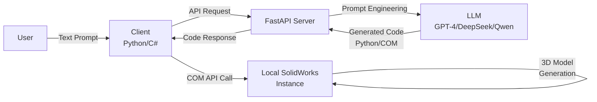
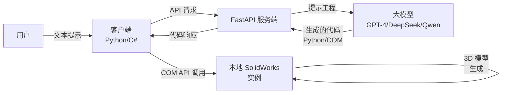

# Vulcan: SolidWorks AI Agent

<p align="center">
  
  
  
  
  <a href="https://www.gnu.org/licenses/gpl-3.0" target="_blank">
  
</a>
</p>

<p align="center">
  <b>AI-powered SolidWorks automation tool that turns natural language into 3D models with one click</b>
</p>

---

## 📑 Table of Contents (English)

1.  [🚀 Overview](#-overview)
2.  [✨ Key Features](#-key-features)
3.  [🏗️ System Architecture](#️-system-architecture)
4.  [📋 Prerequisites](#-prerequisites)
5.  [💾 Installation](#-installation)
    1.  [1. Clone the Repository](#1-clone-the-repository)
    2.  [Beta Version (Legacy)](#beta-version-legacy)
        1.  [Server Setup (Beta)](#server-setup-beta)
        2.  [Client Setup (Beta)](#client-setup-beta)
    3.  [Rebuilt Version (Latest)](#rebuilt-version-latest)
        1.  [Server Setup (Rebuilt)](#server-setup-rebuilt)
        2.  [Client Setup (C#)](#client-setup-c)
6.  [⚙️ Configuration](#️-configuration)
    1.  [Server Environment Variables](#server-environment-variables)
    2.  [Client Environment Variables](#client-environment-variables)
        1.  [Beta Python Client](#beta-python-client)
        2.  [Rebuilt C# Client](#rebuilt-c-client)
7.  [🏁 Quick Start](#-quick-start)
    1.  [1. Prepare SolidWorks](#1-prepare-solidworks)
    2.  [2. Start the Server](#2-start-the-server)
    3.  [3. Launch the Client](#3-launch-the-client)
    4.  [4. Generate Your First Model](#4-generate-your-first-model)
8.  [📁 Project Structure](#-project-structure)
9.  [🔧 Troubleshooting](#-troubleshooting)
    1.  [Common Issues & Fixes](#common-issues--fixes)
10. [🤝 Contributing](#-contributing)
    1.  [Development Guidelines](#development-guidelines)
11. [📄 License](#-license)

---

## 🚀 Overview

**Vulcan** is a client-server AI assistant for SolidWorks, designed to bridge natural language commands and SolidWorks' COM API. It enables engineers and designers to generate 3D models directly from text prompts, eliminating repetitive manual operations and accelerating the design workflow.

The project maintains two development tracks:
- **Beta Version**: Original Python-based client/server (stable, legacy)
- **Rebuilt Version**: Refactored architecture with C# client (Vulcan.SolidWorksClient) and optimized Python server (latest, actively developed)

The server hosts LLM logic for code generation, while the lightweight Windows client connects to local SolidWorks instances to execute generated code.

---

## ✨ Key Features

- 🤖 **Natural Language Modeling**: Generate complete 3D features with plain text prompts (no coding required)
- 🔌 **Client-Server Decoupling**: Server can be deployed locally or on remote cloud instances (Linux/macOS/Windows)
- 🎨 **Dual Client Support**:
  - Legacy PyQt5 UI (beta) with dark theme & always-on-top mode
  - Refactored C# client (rebuild) with native SolidWorks integration
- 🛠️ **Comprehensive Modeling Toolset**:
  - Sketch: Rectangles, Circles, Lines, Arcs (Front/Top/Right reference planes)
  - Features: Boss Extrude, Cut Extrude
  - Utilities: Fillet, Chamfer (with manual selection assist)
- 🔗 **LLM Compatibility**: Works with OpenAI API and OpenAI-compatible endpoints (DeepSeek, Qwen, Claude, etc.)
- 📝 **Full Transparency**: Real-time execution logs and AI thought process display
- 🔄 **Version Flexibility**: Support for SolidWorks 2020-2025 (tested on 2025)

---

## 🏗️ System Architecture



---

## 📋 Prerequisites

### General
- Python 3.8 ~ 3.11 (optimal compatibility with SolidWorks COM API)
- .NET Framework (for C# client in rebuilt version, compatible with SolidWorks add-in requirements)

### Server Requirements
- Cross-platform support (Windows, Linux, macOS)
- Valid API key for OpenAI (or OpenAI-compatible LLM service)

### Client Requirements
- **Windows OS only** (SolidWorks is Windows-exclusive)
- SolidWorks 2020 ~ 2025 (tested on 2025)
- `pywin32` (for Python client COM interaction)
- Visual Studio (optional, for building C# client)

---

## 💾 Installation

### 1. Clone the Repository
```bash
git clone https://github.com/your-username/Vulcan.git
cd Vulcan
```

---

### Beta Version (Legacy)
Original Python-based implementation (stable, legacy support)

#### Server Setup (Beta)
```bash
# Navigate to beta server directory
cd beta/server-python-beta

# Create and activate virtual environment
# Windows
python -m venv venv
venv\Scripts\activate

# Linux/macOS
python3 -m venv venv
source venv/bin/activate

# Install dependencies
pip install -r requirements.txt
```

#### Client Setup (Beta)
```bash
# Open new terminal, navigate to beta client directory
cd beta/client-python-beta

# Create and activate virtual environment
python -m venv venv
venv\Scripts\activate

# Install dependencies
pip install -r requirements.txt
```

---

### Rebuilt Version (Latest)
Refactored architecture with C# client and optimized Python server (actively developed)

#### Server Setup (Rebuilt)
```bash
# Navigate to rebuilt server directory
cd release/server

# Create and activate virtual environment
# Windows
python -m venv venv
venv\Scripts\activate

# Linux/macOS
python3 -m venv venv
source venv/bin/activate

# Install dependencies
# Note: Create a requirements.txt in release/server/ if not exists
pip install -r requirements.txt
```

#### Client Setup (C#)
1. Open `rebuild/client/Vulcan.SolidWorksClient/Vulcan.SolidWorksClient.csproj` in Visual Studio
2. Restore NuGet packages (Newtonsoft.Json, SolidWorks.Interop)
3. Build the project (Debug/Release configuration for x64 architecture)
4. Register the add-in with SolidWorks (follow SolidWorks add-in installation guidelines)

---

## ⚙️ Configuration

### Server Environment Variables
Create a `.env` file in the server directory (beta: `beta/server-python-beta/`, rebuild: `rebuild/server/`) with the following configuration. **Never commit this file to GitHub**.

```env
# ==============================================================================
# LLM API Configuration (Core)
# ==============================================================================
# OpenAI Official
OPENAI_API_KEY="sk-proj-xxxxxxxxxxxxxxxxxxxxxxxxxxxxxxxx"
OPENAI_BASE_URL="https://api.openai.com/v1"
MODEL_NAME="gpt-4o"

# Alternative: DeepSeek
# OPENAI_API_KEY="sk-xxxxxxxxxxxxxxxxxxxxxxxx"
# OPENAI_BASE_URL="https://api.deepseek.com/v1"
# MODEL_NAME="deepseek-chat"

# Alternative: Alibaba Qwen
# OPENAI_API_KEY="sk-xxxxxxxxxxxxxxxxxxxxxxxx"
# OPENAI_BASE_URL="https://dashscope.aliyuncs.com/compatible-mode/v1"
# MODEL_NAME="qwen-plus"

# ==============================================================================
# Server Configuration
# ==============================================================================
HOST="0.0.0.0"
PORT="8000"
```

For team collaboration, create a `.env.example` file (safe to commit) with placeholder values:
```env
OPENAI_API_KEY=""
OPENAI_BASE_URL="https://api.openai.com/v1"
MODEL_NAME="gpt-4o"

HOST="0.0.0.0"
PORT="8000"
```

---

### Client Environment Variables

#### Beta Python Client
Create a `.env` file in `beta/client-python-beta/`:
```env
# Local server (same machine)
AGENT_SERVER_URL="http://127.0.0.1:8000"

# Remote server (cloud deployment)
# AGENT_SERVER_URL="http://<your-server-ip>:8000"
```

#### Rebuilt C# Client
Update the API endpoint in `rebuild/client/Vulcan.SolidWorksClient/Services/ApiClient.cs`:
```csharp
private readonly string _serverUrl = "http://127.0.0.1:8000"; // Modify for remote server
```

---

## 🏁 Quick Start

### 1. Prepare SolidWorks
- Open SolidWorks on your Windows machine
- Create a new empty **Part** document

### 2. Start the Server

#### Beta Version
```bash
# In beta/server-python-beta directory (venv activated)
python main.py
```

#### Rebuilt Version
```bash
# In release/server directory (venv activated)
python main.py
```

**Successful server startup output:**
```
INFO:     Uvicorn running on http://0.0.0.0:8000 (Press CTRL+C to quit)
```

### 3. Launch the Client

#### Run Beta Version (Python UI)
```bash
# In beta/client-python-beta directory (venv activated)
python main.py
```

#### Run Rebuilt Version (C# Add-in)
1. Build the C# project in Visual Studio (x64 Release)
2. Load the add-in in SolidWorks:
   - Go to **Tools > Add-ins**
   - Browse and select the built `Vulcan.SolidWorksClient.dll`
   - Enable the add-in

### 4. Generate Your First Model
- Enter a prompt in the input box (beta UI / C# add-in panel), e.g.:
  ```
  Create a 100x100 square on the Front Plane, then extrude it 50mm high
  ```
- Click **🚀 Send & Execute**
- Watch the AI generate and execute code in real time, with the 3D model appearing in SolidWorks

---

## 📁 Project Structure

```text
Vulcan/
├── .gitignore                # Ignore .env, venv, cache, build artifacts
├── README.md                 # Project documentation
├── .idea/                    # IDE configuration (JetBrains)
├── .venv/                    # Global virtual environment
├── .vs/                      # Visual Studio configuration
├── beta/                     # Legacy beta implementation
│   ├── client-csharp-beta/   # Early C# client prototype
│   │   └── VulcanAddin/      # C# add-in beta code
│   ├── client-python-beta/   # Python PyQt5 client (legacy)
│   │   ├── remote/           # Server API communication
│   │   ├── sw_agent/         # SolidWorks COM interaction
│   │   └── __pycache__/      # Python compiled cache
│   └── server-python-beta/   # Python FastAPI server (legacy)
│       ├── api/              # API routes (v1)
│       ├── core/             # LLM client & prompt management
│       ├── models/           # Pydantic schemas
│       └── __pycache__/      # Python compiled cache
└── rebuild/                  # Refactored main implementation
    ├── client/               # C# SolidWorks client/add-in
    │   └── Vulcan.SolidWorksClient/
    │       ├── bin/          # Build outputs (Debug/Release/x64)
    │       ├── Core/         # Core client logic
    │       ├── Models/       # Data models
    │       ├── obj/          # Build intermediates
    │       ├── packages/     # NuGet packages
    │       ├── Properties/   # Project properties
    │       ├── ReferenceDLL/ # SolidWorks interop DLLs
    │       ├── Services/     # API & COM services
    │       └── UI/           # Client UI components
    └── server/               # Optimized Python server
        ├── services/         # Core server services
        ├── utils/            # Utility functions
        └── __pycache__/      # Python compiled cache
```

---

## 🔧 Troubleshooting

### Common Issues & Fixes

1. **SolidWorks Connection Failed**
   - Ensure SolidWorks is running with an open Part document before launching the client
   - Run the client/add-in with Administrator privileges (required for COM API access)
   - Verify Python version is 3.8~3.11 (newer versions have pywin32 compatibility issues)
   - For C# client: Ensure correct SolidWorks Interop DLL versions (matching your SolidWorks release)

2. **"Target computer actively refused the connection"**
   - Confirm the server is running and accessible
   - Validate `AGENT_SERVER_URL` (Python client) or `_serverUrl` (C# client) is correct
   - For remote servers: Ensure port 8000 is open in firewalls/security groups

3. **Sketch Generated but Extrusion Fails**
   - Known compatibility issue with SolidWorks 2025 COM API `FeatureExtrusion2` parameters
   - Manual workaround: Right-click the generated sketch in FeatureManager and extrude manually
   - Fix: Record a SolidWorks macro of extrusion and update parameters in `sw_operations.py` (Python) or COM service (C#)

4. **AI Returns Empty/None Code**
   - Restart the server to apply latest prompt changes
   - Verify API key validity and sufficient balance
   - Use a more powerful model (gpt-4o, deepseek-chat) for better JSON format compliance

5. **C# Add-in Not Loading**
   - Ensure build architecture (x64) matches SolidWorks (64-bit)
   - Check SolidWorks add-in registry entries (run Visual Studio as Administrator)
   - Verify all NuGet packages are restored and referenced correctly

---

## 🤝 Contributing

Contributions are welcome! Please follow these steps:
1. Fork the repository
2. Create a feature branch (`git checkout -b feature/amazing-feature`)
3. Commit changes (`git commit -m 'Add some amazing feature'`)
4. Push to the branch (`git push origin feature/amazing-feature`)
5. Open a Pull Request

### Development Guidelines
- For beta version changes: Target `beta/` directory
- For main development: Target `rebuild/` directory
- Follow PEP8 for Python code, C# Coding Conventions for .NET code
- Include test cases for new features
- Update documentation for any functional changes

---

## 📄 License

Distributed under the **GNU General Public License v3.0**. See [LICENSE](https://www.gnu.org/licenses/gpl-3.0) for more information.

---

---

# Vulcan: SolidWorks AI 智能体

<p align="center">
  
  
  
  
  <a href="https://www.gnu.org/licenses/gpl-3.0" target="_blank">
  
</a>
</p>

<p align="center">
  <b>由 AI 驱动的 SolidWorks 自动化工具，一键将自然语言转化为 3D 模型</b>
</p>

---

## 📑 目录 (中文)

1.  [🚀 项目简介](#-项目简介-1)
2.  [✨ 功能特性](#-功能特性-1)
3.  [🏗️ 系统架构](#️-系统架构-1)
4.  [📋 环境要求](#-环境要求)
5.  [💾 安装指南](#-安装指南-1)
    1.  [1. 克隆仓库](#1-克隆仓库)
    2.  [Beta 版本 (旧版)](#beta-版本-旧版)
        1.  [服务端配置 (Beta)](#服务端配置-beta)
        2.  [客户端配置 (Beta)](#客户端配置-beta)
    3.  [Rebuild 版本 (最新)](#rebuild-版本-最新)
        1.  [服务端配置 (Rebuild)](#服务端配置-rebuild)
        2.  [客户端配置 (C#)](#客户端配置-c)
6.  [⚙️ 配置说明](#️-配置说明)
    1.  [服务端环境变量](#服务端环境变量)
    2.  [客户端环境变量](#客户端环境变量)
        1.  [Beta Python 客户端](#beta-python-客户端)
        2.  [Rebuild C# 客户端](#rebuild-c-客户端)
7.  [🏁 快速开始](#-快速开始-1)
    1.  [1. 准备 SolidWorks](#1-准备-solidworks)
    2.  [2. 启动服务端](#2-启动服务端)
    3.  [3. 启动客户端](#3-启动客户端)
    4.  [4. 生成你的第一个模型](#4-生成你的第一个模型)
8.  [📁 项目结构](#-项目结构-1)
9.  [🔧 故障排除](#-故障排除)
    1.  [常见问题与解决方案](#常见问题与解决方案)
10. [🤝 贡献指南](#-贡献指南-1)
    1.  [开发规范](#开发规范)
11. [📄 许可证](#-许可证-1)

---

## 🚀 项目简介

**Vulcan** 是一个用于 SolidWorks 的客户端-服务器架构 AI 助手，旨在连接自然语言指令与 SolidWorks COM API。它使工程师和设计师能够直接通过文本提示生成 3D 模型，消除了重复的手动操作，加速了设计工作流程。

本项目维护两条开发路线：
- **Beta 版本**：原始的基于 Python 的客户端/服务端（稳定，旧版）
- **Rebuild 版本**：重构架构，包含 C# 客户端 (Vulcan.SolidWorksClient) 和优化的 Python 服务端（最新，活跃开发）

服务端承载用于代码生成的 LLM 逻辑，而轻量级的 Windows 客户端连接到本地 SolidWorks 实例以执行生成的代码。

---

## ✨ 功能特性

- 🤖 **自然语言建模**：使用纯文本提示生成完整的 3D 特征（无需编码）
- 🔌 **客户端-服务端解耦**：服务端可以部署在本地或远程云实例（Linux/macOS/Windows）
- 🎨 **双客户端支持**：
  - 旧版 PyQt5 UI (Beta)，带有深色主题和置顶模式
  - 重构的 C# 客户端 (Rebuild)，具有原生 SolidWorks 集成
- 🛠️ **全面的建模工具集**：
  - 草图：矩形、圆形、直线、圆弧（前视/上视/右视基准面）
  - 特征：拉伸凸台、拉伸切除
  - 工具：圆角、倒角（带手动选择辅助）
- 🔗 **LLM 兼容性**：支持 OpenAI API 和兼容 OpenAI 的端点（DeepSeek、Qwen、Claude 等）
- 📝 **完全透明**：实时执行日志和 AI 思考过程显示
- 🔄 **版本灵活性**：支持 SolidWorks 2020-2025（在 2025 上测试）

---

## 🏗️ 系统架构



---

## 📋 环境要求

### 通用要求
- Python 3.8 ~ 3.11（与 SolidWorks COM API 的最佳兼容性）
- .NET Framework（用于 Rebuild 版本的 C# 客户端，与 SolidWorks 插件要求兼容）

### 服务端要求
- 跨平台支持（Windows、Linux、macOS）
- 有效的 OpenAI（或兼容 OpenAI 的 LLM 服务）API 密钥

### 客户端要求
- **仅限 Windows 操作系统**（SolidWorks 是 Windows 专属软件）
- SolidWorks 2020 ~ 2025（在 2025 上测试）
- `pywin32`（用于 Python 客户端的 COM 交互）
- Visual Studio（可选，用于构建 C# 客户端）

---

## 💾 安装指南

### 1. 克隆仓库
```bash
git clone https://github.com/your-username/Vulcan.git
cd Vulcan
```

---

### Beta 版本 (旧版)
原始的基于 Python 的实现（稳定，旧版支持）

#### 服务端配置 (Beta)
```bash
# 进入 Beta 服务端目录
cd beta/server-python-beta

# 创建并激活虚拟环境
# Windows
python -m venv venv
venv\Scripts\activate

# Linux/macOS
python3 -m venv venv
source venv/bin/activate

# 安装依赖
pip install -r requirements.txt
```

#### 客户端配置 (Beta)
```bash
# 打开新终端，进入 Beta 客户端目录
cd beta/client-python-beta

# 创建并激活虚拟环境
python -m venv venv
venv\Scripts\activate

# 安装依赖
pip install -r requirements.txt
```

---

### Rebuild 版本 (最新)
重构架构，包含 C# 客户端和优化的 Python 服务端（活跃开发）

#### 服务端配置 (Rebuild)
```bash
# 进入 Rebuild 服务端目录
cd release/server

# 创建并激活虚拟环境
# Windows
python -m venv venv
venv\Scripts\activate

# Linux/macOS
python3 -m venv venv
source venv/bin/activate

# 安装依赖
# 注意：如果 release/server/ 目录下没有 requirements.txt，请先创建
pip install -r requirements.txt
```

#### 客户端配置 (C#)
1. 使用 Visual Studio 打开 `rebuild/client/Vulcan.SolidWorksClient/Vulcan.SolidWorksClient.csproj`
2. 还原 NuGet 包（Newtonsoft.Json、SolidWorks.Interop）
3. 生成项目（x64 架构的 Debug/Release 配置）
4. 在 SolidWorks 中注册插件（遵循 SolidWorks 插件安装指南）

---

## ⚙️ 配置说明

### 服务端环境变量
在服务端目录（Beta: `beta/server-python-beta/`，Rebuild: `rebuild/server/`）中创建一个 `.env` 文件，并包含以下配置。**切勿将此文件提交到 GitHub**。

```env
# ==============================================================================
# 大模型 API 配置 (核心)
# ==============================================================================
# OpenAI 官方
OPENAI_API_KEY="sk-proj-xxxxxxxxxxxxxxxxxxxxxxxxxxxxxxxx"
OPENAI_BASE_URL="https://api.openai.com/v1"
MODEL_NAME="gpt-4o"

# 替代方案：DeepSeek
# OPENAI_API_KEY="sk-xxxxxxxxxxxxxxxxxxxxxxxx"
# OPENAI_BASE_URL="https://api.deepseek.com/v1"
# MODEL_NAME="deepseek-chat"

# 替代方案：阿里通义千问
# OPENAI_API_KEY="sk-xxxxxxxxxxxxxxxxxxxxxxxx"
# OPENAI_BASE_URL="https://dashscope.aliyuncs.com/compatible-mode/v1"
# MODEL_NAME="qwen-plus"

# ==============================================================================
# 服务端配置
# ==============================================================================
HOST="0.0.0.0"
PORT="8000"
```

对于团队协作，创建一个 `.env.example` 文件（可安全提交），包含占位符值：
```env
OPENAI_API_KEY=""
OPENAI_BASE_URL="https://api.openai.com/v1"
MODEL_NAME="gpt-4o"

HOST="0.0.0.0"
PORT="8000"
```

---

### 客户端环境变量

#### Beta Python 客户端
在 `beta/client-python-beta/` 中创建 `.env` 文件：
```env
# 本地服务端（同一台机器）
AGENT_SERVER_URL="http://127.0.0.1:8000"

# 远程服务端（云端部署）
# AGENT_SERVER_URL="http://<你的服务器IP>:8000"
```

#### Rebuild C# 客户端
在 `rebuild/client/Vulcan.SolidWorksClient/Services/ApiClient.cs` 中更新 API 端点：
```csharp
private readonly string _serverUrl = "http://127.0.0.1:8000"; // 对于远程服务器请修改此处
```

---

## 🏁 快速开始

### 1. 准备 SolidWorks
- 在你的 Windows 机器上打开 SolidWorks
- 创建一个新的空 **零件** 文档

### 2. 启动服务端

#### Beta 版本
```bash
# 在 beta/server-python-beta 目录下（已激活 venv）
python main.py
```

#### Rebuild 版本
```bash
# 在 release/server 目录下（已激活 venv）
python main.py
```

**服务端启动成功输出：**
```
INFO:     Uvicorn running on http://0.0.0.0:8000 (Press CTRL+C to quit)
```

### 3. 启动客户端

#### 运行 Beta 版本 (Python UI)
```bash
# 在 beta/client-python-beta 目录下（已激活 venv）
python main.py
```

#### 运行 Rebuild 版本 (C# 插件)
1. 在 Visual Studio 中生成 C# 项目（x64 Release）
2. 在 SolidWorks 中加载插件：
   - 转到 **工具 (Tools) > 插件 (Add-ins)**
   - 浏览并选择生成的 `Vulcan.SolidWorksClient.dll`
   - 启用插件

### 4. 生成你的第一个模型
- 在输入框（Beta UI / C# 插件面板）中输入提示，例如：
  ```
  在前视基准面上创建一个 100x100 的正方形，然后拉伸 50mm 高
  ```
- 点击 **🚀 发送并执行**
- 观察 AI 实时生成和执行代码，3D 模型将出现在 SolidWorks 中

---

## 📁 项目结构

```text
Vulcan/
├── .gitignore                # 忽略 .env、venv、缓存、构建产物
├── README.md                 # 项目文档
├── .idea/                    # IDE 配置 (JetBrains)
├── .venv/                    # 全局虚拟环境
├── .vs/                      # Visual Studio 配置
├── beta/                     # 旧版 Beta 实现
│   ├── client-csharp-beta/   # 早期 C# 客户端原型
│   │   └── VulcanAddin/      # C# 插件 Beta 代码
│   ├── client-python-beta/   # Python PyQt5 客户端 (旧版)
│   │   ├── remote/           # 服务端 API 通信
│   │   ├── sw_agent/         # SolidWorks COM 交互
│   │   └── __pycache__/      # Python 编译缓存
│   └── server-python-beta/   # Python FastAPI 服务端 (旧版)
│       ├── api/              # API 路由 (v1)
│       ├── core/             # 大模型客户端和提示管理
│       ├── models/           # Pydantic 模式
│       └── __pycache__/      # Python 编译缓存
└── rebuild/                  # 重构的主实现
    ├── client/               # C# SolidWorks 客户端/插件
    │   └── Vulcan.SolidWorksClient/
    │       ├── bin/          # 构建输出 (Debug/Release/x64)
    │       ├── Core/         # 核心客户端逻辑
    │       ├── Models/       # 数据模型
    │       ├── obj/          # 构建中间文件
    │       ├── packages/     # NuGet 包
    │       ├── Properties/   # 项目属性
    │       ├── ReferenceDLL/ # SolidWorks 互操作 DLL
    │       ├── Services/     # API 和 COM 服务
    │       └── UI/           # 客户端 UI 组件
    └── server/               # 优化的 Python 服务端
        ├── services/         # 核心服务端服务
        ├── utils/            # 工具函数
        └── __pycache__/      # Python 编译缓存
```

---

## 🔧 故障排除

### 常见问题与解决方案

1. **SolidWorks 连接失败**
   - 确保在启动客户端之前，SolidWorks 正在运行并打开了一个零件文档
   - 以管理员权限运行客户端/插件（COM API 访问需要）
   - 验证 Python 版本为 3.8~3.11（较新版本存在 pywin32 兼容性问题）
   - 对于 C# 客户端：确保 SolidWorks 互操作 DLL 版本正确（与你的 SolidWorks 版本匹配）

2. **"目标计算机积极拒绝了连接"**
   - 确认服务端正在运行且可访问
   - 验证 `AGENT_SERVER_URL`（Python 客户端）或 `_serverUrl`（C# 客户端）是否正确
   - 对于远程服务器：确保防火墙/安全组中开放了 8000 端口

3. **草图已生成但拉伸失败**
   - 已知的 SolidWorks 2025 COM API `FeatureExtrusion2` 参数兼容性问题
   - 手动解决方法：在 FeatureManager 中右键单击生成的草图并手动拉伸
   - 修复方法：录制一个 SolidWorks 拉伸宏，并在 `sw_operations.py`（Python）或 COM 服务（C#）中更新参数

4. **AI 返回空/None 代码**
   - 重启服务端以应用最新的提示更改
   - 验证 API 密钥有效性和余额充足
   - 使用更强大的模型（gpt-4o、deepseek-chat）以获得更好的 JSON 格式合规性

5. **C# 插件未加载**
   - 确保生成架构（x64）与 SolidWorks（64 位）匹配
   - 检查 SolidWorks 插件注册表项（以管理员身份运行 Visual Studio）
   - 验证所有 NuGet 包已还原并正确引用

---

## 🤝 贡献指南

欢迎贡献！请遵循以下步骤：
1. Fork 本仓库
2. 创建你的特性分支 (`git checkout -b feature/amazing-feature`)
3. 提交更改 (`git commit -m 'Add some amazing feature'`)
4. 推送到分支 (`git push origin feature/amazing-feature`)
5. 开启一个 Pull Request

### 开发规范
- 对于 Beta 版本更改：目标目录为 `beta/`
- 对于主开发：目标目录为 `rebuild/`
- Python 代码遵循 PEP8，.NET 代码遵循 C# 编码规范
- 为新功能包含测试用例
- 为任何功能更改更新文档

---

## 📄 许可证

本项目采用 **GNU 通用公共许可证 v3.0** 分发。有关更多信息，请参阅 [LICENSE](https://www.gnu.org/licenses/gpl-3.0)。