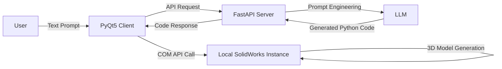

# Vulcan: SolidWorks AI Agent
<p align="center">
  
  
  
  <a href="https://www.gnu.org/licenses/gpl-3.0" target="_blank">
  
</a>
</p>


<p align="center">
  <b>AI-powered SolidWorks automation tool that turns natural language into 3D models with one click</b>
</p>

---

## Table of Contents
- [Overview](#overview)
- [Key Features](#key-features)
- [System Architecture](#system-architecture)
- [Prerequisites](#prerequisites)
- [Installation](#installation)
  - [Server Setup](#server-setup)
  - [Client Setup](#client-setup)
- [Configuration](#configuration)
  - [Server Environment Variables](#server-environment-variables)
  - [Client Environment Variables](#client-environment-variables)
- [Quick Start](#quick-start)
- [Project Structure](#project-structure)
- [Troubleshooting](#troubleshooting)
- [Contributing](#contributing)
- [License](#license)

---

## Overview
Vulcan is a client-server AI assistant for SolidWorks, designed to bridge natural language commands and SolidWorks' COM API. It allows engineers and designers to generate 3D models directly from text prompts, eliminating repetitive manual operations and accelerating the design workflow.

The project uses a decoupled architecture: the server hosts the LLM logic for code generation, while the lightweight Windows client connects to your local SolidWorks instance to execute the generated code.

---

## Key Features
- 🤖 **Natural Language Modeling**: Generate complete 3D features with plain text prompts (no coding required)
- 🔌 **Client-Server Decoupling**: Server can be deployed locally or on a remote cloud instance
- 🎨 **Modern Desktop UI**: Sleek, dark-themed PyQt5 interface with always-on-top mode for SolidWorks integration
- 🛠️ **Comprehensive Modeling Toolset**:
  - Sketch: Rectangles, Circles, Lines, Arcs (supports Front/Top/Right reference planes)
  - Features: Boss Extrude, Cut Extrude
  - Utilities: Fillet, Chamfer (with manual selection assist)
- 🔗 **LLM Compatibility**: Works with OpenAI API and any OpenAI-compatible endpoints (DeepSeek, Qwen, Claude, etc.)
- 📝 **Full Transparency**: Real-time execution logs and AI thought process display

---

## System Architecture


---

## Prerequisites
### General
- Python 3.8 ~ 3.11 (optimal compatibility with SolidWorks COM API)

### Server Requirements
- Cross-platform support (Windows, Linux, macOS)
- Valid API key for OpenAI (or OpenAI-compatible LLM service)

### Client Requirements
- **Windows OS only** (SolidWorks is Windows-exclusive)
- SolidWorks 2020 ~ 2025 (tested on 2025)
- `pywin32` for SolidWorks COM interaction

---

## Installation
### 1. Clone the Repository
```bash
git clone https://github.com/your-username/Vulcan.git
cd Vulcan
```

### Server Setup
The server hosts the FastAPI backend and LLM integration. It can be run on the same Windows machine as the client, or on a remote Linux/macOS server.

1. Navigate to the server directory
```bash
cd server
```

2. Create and activate a virtual environment
```bash
# Windows
python -m venv venv
venv\Scripts\activate

# Linux/macOS
python3 -m venv venv
source venv/bin/activate
```

3. Install dependencies
```bash
pip install -r requirements.txt
```

### Client Setup
The client is a Windows-only PyQt5 application that connects to your local SolidWorks instance.

1. Open a new PowerShell/CMD terminal and navigate to the client directory
```bash
cd client-python-beta
```

2. Create and activate a virtual environment
```bash
python -m venv venv
venv\Scripts\activate
```

3. Install dependencies
```bash
pip install -r requirements.txt
```

---

## Configuration
### Server Environment Variables
Create a `.env` file in the `server/` directory with the following configuration. **Never commit this file to GitHub**.

```env
# ==============================================================================
# LLM API Configuration (Core)
# ==============================================================================
# OpenAI Official
OPENAI_API_KEY="sk-proj-xxxxxxxxxxxxxxxxxxxxxxxxxxxxxxxx"
OPENAI_BASE_URL="https://api.openai.com/v1"
MODEL_NAME="gpt-4o"

# Alternative: DeepSeek
# OPENAI_API_KEY="sk-xxxxxxxxxxxxxxxxxxxxxxxx"
# OPENAI_BASE_URL="https://api.deepseek.com/v1"
# MODEL_NAME="deepseek-chat"

# Alternative: Alibaba Qwen
# OPENAI_API_KEY="sk-xxxxxxxxxxxxxxxxxxxxxxxx"
# OPENAI_BASE_URL="https://dashscope.aliyuncs.com/compatible-mode/v1"
# MODEL_NAME="qwen-plus"

# ==============================================================================
# Server Configuration
# ==============================================================================
HOST="0.0.0.0"
PORT="8000"
```

For team collaboration, create a `server/.env.example` file (safe to commit) with placeholder values:
```env
OPENAI_API_KEY=""
OPENAI_BASE_URL="https://api.openai.com/v1"
MODEL_NAME="gpt-4o"

HOST="0.0.0.0"
PORT="8000"
```

### Client Environment Variables
Create a `.env` file in the `client/` directory to point to your server instance:
```env
# Local server (same machine)
AGENT_SERVER_URL="http://127.0.0.1:8000"

# Remote server (cloud deployment)
# AGENT_SERVER_URL="http://<your-server-ip>:8000"
```

---

## Quick Start
1. **Start the Server**
   ```bash
   # In the server directory, with venv activated
   python main.py
   ```
   You should see the following output when the server starts successfully:
   ```
   INFO:     Uvicorn running on http://0.0.0.0:8000 (Press CTRL+C to quit)
   ```

2. **Prepare SolidWorks**
   - Open SolidWorks on your Windows machine
   - Create a new empty **Part** document

3. **Launch the Client UI**
   ```bash
   # In the client-python-beta directory, with venv activated
   python main.py
   ```
   A modern dark-themed UI will launch and automatically connect to your running SolidWorks instance.

4. **Generate Your First Model**
   - Enter a prompt in the input box, e.g.:
     ```
     Create a 100x100 square on the Front Plane, then extrude it 50mm high
     ```
   - Click **🚀 Send & Execute**
   - Watch the AI generate and execute the code in real time, and your 3D model appear in SolidWorks

---

## Project Structure
```text
Vulcan/
├── .gitignore                # Ignore .env files, venv, and cache
├── README.md                 # This file
├── server/                   # FastAPI Backend
│   ├── main.py               # Server entry point
│   ├── requirements.txt      # Server dependencies
│   ├── .env                  # Server configuration (gitignored)
│   ├── .env.example          # Example config template
│   ├── api/
│   │   └── v1/agent.py       # API routes for code generation
│   ├── core/
│   │   ├── llm_client.py     # Async LLM API client
│   │   └── prompt_manager.py # System prompt engineering
│   └── models/
│       └── schemas.py        # Pydantic request/response models
└── client/                   # Windows SolidWorks Client
    ├── main.py               # UI entry point
    ├── sw_agent_ui.py        # PyQt5 main interface
    ├── requirements.txt      # Client dependencies
    ├── .env                  # Client configuration (gitignored)
    ├── sw_agent/
    │   ├── sw_connection.py  # SolidWorks COM connection handler
    │   └── sw_operations.py  # Modeling function library
    └── remote/
        └── api_client.py     # Server API communication client
```

---

## Troubleshooting
### Common Issues & Fixes
1. **SolidWorks Connection Failed**
   - Ensure SolidWorks is running and a Part document is open before launching the client
   - Run the client terminal with Administrator privileges (required for COM API access)
   - Verify your Python version is 3.8~3.11 (newer versions may have pywin32 compatibility issues)

2. **"Target computer actively refused the connection"**
   - Ensure the server is running and accessible
   - Check that the `AGENT_SERVER_URL` in `client/.env` is correct
   - If using a remote server, ensure port 8000 is open in the firewall/security group

3. **Sketch is generated but extrusion fails**
   - This is a known compatibility issue with SolidWorks 2025 COM API parameters
   - The sketch is fully functional: right-click the generated sketch in the SolidWorks FeatureManager and extrude manually
   - For full auto-extrusion support, record a SolidWorks macro of an extrusion and replace the `FeatureExtrusion2` parameters in `sw_operations.py`

4. **AI returns empty/None code**
   - Restart the server to apply the latest prompt changes
   - Verify your API key is valid and has sufficient balance
   - Use a more powerful model (e.g., gpt-4o, deepseek-chat) for better JSON format compliance

---

## Contributing
Contributions are welcome! Please follow these steps:
1. Fork the repository
2. Create a feature branch (`git checkout -b feature/amazing-feature`)
3. Commit your changes (`git commit -m 'Add some amazing feature'`)
4. Push to the branch (`git push origin feature/amazing-feature`)
5. Open a Pull Request

---

## License
Distributed under the GPL v3 License. See `LICENSE` for more information.