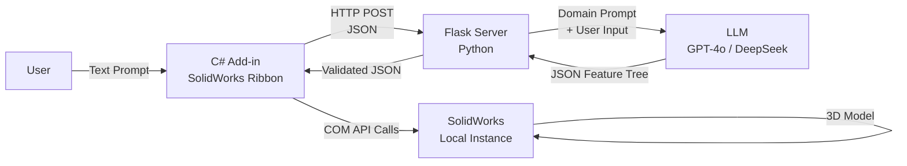

<h1 align="center">Vulcan</h1>

<p align="center">
  
  
  
  
  <a href="https://www.gnu.org/licenses/gpl-3.0"></a>
</p>

<p align="center">
  <strong>AI-powered SolidWorks automation — turn natural language into 3D models with one click</strong>
  <br>
  C/S architecture · JSON-params pipeline · native SolidWorks add-in integration
</p>

<p align="center">
  <a href="./README.md">English</a> | <a href="./README.zh-CN.md">中文</a>
</p>

---

## Name Origin

<p align="center">
  <strong>Vulcan</strong> — the Roman god of fire, metalworking, and the forge.
</p>

In mythology, Vulcan crafted the weapons and armour of the gods inside his volcanic workshop. His forge was where raw material met deliberate intent — a fitting namesake for a tool that translates unstructured human language into precise, parametric 3D geometry. The hammer strikes; the model appears.

---

## About the Project

**Vulcan** bridges natural language and SolidWorks' COM API through a client-server architecture. Engineers and designers describe what they want in plain text; the system reasons about reference planes, feature order, and geometric constraints, then drives SolidWorks to produce the result.

This is not just a macro recorder or a code snippet generator. It is a structured pipeline:

```
User text → domain-aware prompt engineering → LLM (JSON output) → validation → COM execution
```

The core insight is that general-purpose LLMs fail at engineering CAD tasks not because they lack intelligence, but because they lack **context**: they don't know the difference between a Front Plane and a Top Plane, or that a cut feature's Z coordinate must fall within the base body's thickness. Vulcan supplies that context through a carefully crafted system prompt — a 165-line domain specification that encodes SolidWorks' coordinate systems, feature type schemas, and parametric constraints into the model's reasoning space.

The project maintains two development tracks reflecting an architectural evolution:

- **Beta (legacy)**: FastAPI + AsyncOpenAI — the LLM generated Python code which was then `exec()`-d on the client. Powerful but fragile: malformed code could crash SolidWorks, and debugging required reading generated scripts.
- **Rebuild (active)**: Flask + requests — the LLM returns a **structured JSON feature tree** (extrudes, cuts, hole patterns) validated server-side, executed deterministically by the C# client. No `exec()`, no code injection risk, fully debuggable.

---

## Key Features

- **Natural Language → 3D Model**: Describe your part in plain English or Chinese; the system handles plane selection, coordinate math, and feature ordering
- **Client-Server Decoupling**: The Python server runs anywhere (local, cloud, Docker); only the thin C# client requires Windows + SolidWorks
- **Structured JSON Pipeline (Rebuild)**: LLM outputs validated JSON, not arbitrary code — deterministic execution, no injection surface
- **Native SolidWorks Add-in**: C# WPF panel embedded in the SolidWorks ribbon, not a separate window
- **Multi-Provider LLM Support**: OpenAI, DeepSeek, Qwen, and any OpenAI-compatible endpoint via `.env` config
- **Domain-Aware Prompt Engineering**: System prompt encodes SolidWorks-specific coordinate rules, feature schemas, and parametric constraints
- **Comprehensive Modeling Toolset**:
  - Sketch: Rectangle, Circle, Slot, Arc, Ellipse, Polygon
  - Features: Boss Extrude, Cut Extrude
  - Pattern: Automatic hole placement (4-corner, N×M grid)
- **SolidWorks 2020–2025**: Version-adaptive COM API parameter handling

---

## Design Decisions

### Why JSON params instead of code generation?

The Beta version had the LLM emit Python code for direct execution. This worked in demos but had fundamental problems: hallucinated API calls could crash SolidWorks, error recovery was nearly impossible, and debugging meant reading generated code you didn't write.

The Rebuild version switched to **LLM-as-schema-driven-parameterizer**: the model fills in a structured JSON template. The C# client owns execution deterministically. If the JSON is valid, the modeling operations are guaranteed to be well-formed. If it isn't, validation catches it before SolidWorks is touched.

### Why C/S instead of a single SolidWorks macro?

1. **LLM providers live in the cloud** — embedding API keys in a client-side macro is a security non-starter
2. **Prompt iteration is continuous** — updating a server prompt takes seconds; updating a deployed add-in requires rebuilding and reinstalling
3. **Server can run headless** — CI/CD integration, batch processing, future web frontend

---

## System Architecture


```mermaid
flowchart LR
    A[User] -->|Text Prompt| B[C# Add-in<br/>SolidWorks Ribbon]
    B -->|HTTP POST<br/>JSON| C[Flask Server<br/>Python]
    C -->|Domain Prompt<br/>+ User Input| D[LLM<br/>GPT-4o / DeepSeek]
    D -->|JSON Feature Tree| C
    C -->|Validated JSON| B
    B -->|COM API Calls| E[SolidWorks<br/>Local Instance]
    E -->|3D Model| E
```

| Layer | Technology | Role |
|-------|-----------|------|
| Client | C# / .NET Framework 4.8, WPF | SolidWorks COM interaction, add-in UI |
| Transport | HTTP REST (JSON) | Single endpoint: `POST /api/v1/generate` |
| Server | Python 3.9+, Flask | Prompt assembly, upstream LLM call, response validation |
| AI Engine | OpenAI-compatible API | JSON feature tree generation |
| Deployment | Docker, Cloudflare Tunnel, or bare-metal | Server runs anywhere; client requires Windows |

---

## Quick Start

### Prerequisites

- **Server**: Python 3.8–3.11, LLM API key
- **Client**: Windows, SolidWorks 2020–2025, .NET Framework 4.8

### 1. Clone

```bash
git clone https://github.com/Robusr/Vulcan.git
cd Vulcan
```

### 2. Start the Server

```bash
cd release/server

python -m venv venv
source venv/bin/activate   # Windows: venv\Scripts\activate
pip install -r requirements.txt

# Configure
cp .env.example .env
# Edit .env: add your LLM API key and model

python app.py
# → Running on http://0.0.0.0:5000
```

### 3. Build & Load the Client

1. Open `release/client/Vulcan.SolidWorksClient/Vulcan.SolidWorksClient.sln` in Visual Studio
2. Restore NuGet packages, build for **x64 Release**
3. Register the add-in (run Visual Studio as Administrator for COM registration)
4. Open SolidWorks → new Part document → **Vulcan AI** tab appears in the ribbon

### 4. Generate Your First Model

Type in the Vulcan panel:

```
前视基准面拉伸200x100x20底座，四角各打一个直径10mm通孔
```

Click **Send & Execute**. The 3D model appears in SolidWorks.

---

## Project Structure

```
Vulcan/
├── README.md
├── README.zh-CN.md
├── LICENSE                        # GPLv3
├── .gitignore
│
├── beta/                          # Legacy (code-generation approach)
│   ├── client-csharp-beta/        #   Early C# add-in prototype
│   ├── client-python-beta/        #   PyQt5 client (deprecated)
│   │   ├── sw_agent/              #     SolidWorks COM interaction
│   │   └── remote/                #     Server API client
│   └── server-python-beta/        #   FastAPI + AsyncOpenAI server
│       ├── api/v1/                #     Route handlers
│       ├── core/                  #     LLM client, prompt manager
│       └── models/                #     Pydantic schemas
│
└── release/                       # Current (JSON-params approach)
    ├── client/
    │   └── Vulcan.SolidWorksClient/
    │       ├── Core/              #   SwAddIn — COM registration & lifecycle
    │       ├── Services/          #   ApiClient, SwModeler, Logger
    │       ├── Models/            #   ModelData
    │       ├── UI/                #   MainWindow (WPF)
    │       ├── ReferenceDLL/      #   SolidWorks Interop assemblies
    │       ├── Vulcan Setup/      #   Inno Setup installer
    │       └── Properties/        #   Assembly metadata
    └── server/
        ├── app.py                 #   Flask entry point
        ├── config.py              #   Environment-based configuration
        ├── Dockerfile             #   Containerized deployment
        ├── prompts/               #   System prompt (versioned)
        │   └── system_prompt.py   #     165-line SolidWorks domain spec
        ├── services/              #   LLM client, parameter validation
        └── utils/                 #   Logging, custom exceptions
```

---

## Configuration

### Server `.env`

```env
QINIU_API_KEY="sk-xxxxxxxxxxxxxxxx"
QINIU_BASE_URL="https://api.qnaigc.com/v1"
QINIU_MODEL="gpt-oss-120b"

FLASK_ENV="development"
FLASK_RUN_PORT="5000"
```

Any OpenAI-compatible provider works — swap the URL and model name.

### C# Client Endpoint

Edit `release/client/Vulcan.SolidWorksClient/Services/ApiClient.cs`:

```csharp
private readonly string _serverUrl = "http://127.0.0.1:5000";
```

---

## Prompt Engineering

The system prompt (`release/server/prompts/system_prompt.py`) is the intellectual core of this project. It encodes:

1. **Output discipline**: pure JSON only, no markdown, no explanations — forces the LLM to commit to structured output
2. **Coordinate system rules**: per-plane axis mappings (Front: X-Y, Top: X-Z, Right: Y-Z), enforced through explicit examples
3. **Feature type schema**: extrude and cut, each with required/optional params, shape-specific sub-schemas
4. **Anti-overlap constraint**: multi-feature models must compute distinct coordinates relative to preceding body dimensions

The prompt is versioned (`PROMPT_VERSION = "2.0.0"`) and lives outside the business logic so it can be iterated independently.

---

## Troubleshooting

| Problem | Likely Cause | Fix |
|---------|-------------|-----|
| SolidWorks connection failed | COM not initialized | Run VS as Admin; ensure a Part doc is open |
| "Target refused connection" | Server not running | Check `python app.py` output; verify port 5000 |
| Sketch ok, extrusion fails | SolidWorks 2025 `FeatureExtrusion2` incompatibility | Record a macro, update params in `SwModeler.cs` |
| AI returns empty / malformed JSON | LLM ignored prompt constraints | Switch to a stronger model (gpt-4o, deepseek-chat); raise `temperature` slightly |
| C# add-in not loading | x86/x64 mismatch | Build for x64 only; SolidWorks is 64-bit |
| Chinese prompt misunderstood | LLM lacks Chinese engineering vocab | Use a Chinese-native model (DeepSeek, Qwen) |

---

## Contributing

Pull requests are welcome. Areas where help would be especially valuable:

- **Feature support**: adding revolve, sweep, loft, fillet/chamfer automation
- **LLM provider adapters**: abstracting the `LLMClient` for easier provider swaps
- **Testing**: SolidWorks COM API integration tests, prompt regression tests

For significant changes, please open an issue first to discuss the approach.

### Development

```bash
# Server
cd release/server
pip install -r requirements.txt
python app.py

# Client — open .sln in Visual Studio, build x64
```

---

## License

Distributed under the **GNU General Public License v3.0**. Derivative works must also be open-sourced under GPLv3. See [LICENSE](LICENSE) for the full text.

---

<p align="center">
  <sub>Built by <a href="https://github.com/Robusr">Robusr</a> — because learning SolidWorks shouldn't require a 200-page manual.✋🏻</sub>
</p>
