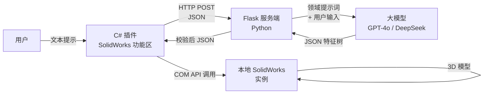

<h1 align="center">Vulcan</h1>

<p align="center">
  
  
  
  
  <a href="https://www.gnu.org/licenses/gpl-3.0"></a>
</p>

<p align="center">
  <strong>AI 驱动的 SolidWorks 自动化工具——自然语言一键生成 3D 模型</strong>
  <br>
  C/S 架构 · JSON 参数管线 · 原生 SolidWorks 插件集成
</p>

<p align="center">
  <a href="./README.md">English</a> | <a href="./README.zh-CN.md">中文</a>
</p>

---

## 名称由来

<p align="center">
  <strong>Vulcan</strong>——罗马神话中的火神与锻冶之神。
</p>

在神话中，伏尔甘在火山深处的熔炉里为众神锻造武器和盔甲。他的锻造场是原材料与刻意意图交汇之地——一个恰如其分的名字：将非结构化的人类语言转化为精确的参数化三维几何。锤落，模型出。

---

## 项目简介

**Vulcan** 通过客户端-服务端架构连接自然语言与 SolidWorks COM API。工程师和设计师用日常语言描述需求，系统自主推理基准面、特征顺序和几何约束，驱动 SolidWorks 生成三维模型。

这不是一个宏录制器，也不是一个代码片段生成器。它是一条结构化管线：

```
用户文本 → 领域提示工程 → 大模型 (JSON 输出) → 校验 → COM 执行
```

核心洞察在于：通用大模型在 CAD 工程任务上表现不佳，不是因为它们不够聪明，而是因为它们缺乏**上下文**——它们不知道前视基准面和上视基准面的区别，也不知道切除特征的 Z 坐标必须落在基体厚度范围内。Vulcan 通过精心设计的系统提示词提供这些上下文——一份 165 行的领域规范，将 SolidWorks 的坐标系规则、特征类型模式和参数约束编码到模型的推理空间中。

项目保持两条开发线，反映了一次架构演进：

- **Beta（旧版）**：FastAPI + AsyncOpenAI——大模型生成 Python 代码，客户端 `exec()` 执行。能力强大但脆弱：畸形代码可能令 SolidWorks 崩溃，调试需要阅读生成的脚本。
- **Rebuild（主力）**：Flask + requests——大模型返回**结构化 JSON 特征树**（拉伸、切除、孔位布局），服务端校验后由 C# 客户端确定性执行。无 `exec()`、无代码注入风险、完全可调试。

---

## 功能特性

- **自然语言 → 3D 模型**：用中文或英文描述零件需求，系统自动处理基准面选择、坐标计算和特征排序
- **客户端-服务端解耦**：Python 服务端可部署在任意位置（本地、云端、Docker）；只有轻量 C# 客户端需要 Windows + SolidWorks
- **结构化 JSON 管线（Rebuild）**：大模型输出经过校验的 JSON，而非任意代码——确定性执行，无注入风险
- **原生 SolidWorks 插件**：C# WPF 面板嵌入 SolidWorks 功能区，而非独立窗口
- **多厂商 LLM 支持**：OpenAI、DeepSeek、通义千问及任意兼容 OpenAI API 的服务，通过 `.env` 切换
- **领域感知型提示工程**：系统提示词内置 SolidWorks 特定坐标系规则、特征模式、参数约束
- **全面建模工具集**：
  - 草图：矩形、圆形、槽口、圆弧、椭圆、正多边形
  - 特征：拉伸凸台、拉伸切除
  - 布局：自动孔位计算（四角、N×M 阵列）
- **SolidWorks 2020–2025**：跨版本自适应 COM API 参数处理

---

## 设计取舍

### 为什么选择 JSON 参数方案而非代码生成？

Beta 版本让大模型直接输出 Python 代码执行。在演示中可行，但存在根本性缺陷：幻觉生成的 API 调用可能令 SolidWorks 崩溃，错误恢复几乎不可能，调试意味着阅读你从未写过的代码。

Rebuild 版本转向**大模型即模式驱动的参数填充器**：模型只需填充结构化 JSON 模板。C# 客户端以确定性方式执行建模操作。JSON 合法，则建模操作必然良构。若不合法，校验层在触及 SolidWorks 之前就会拦截。

### 为什么是 C/S 架构而非单一 SolidWorks 宏？

1. **大模型密钥存在于云端**——将 API 密钥嵌入客户端宏是安全禁忌
2. **提示词迭代是持续过程**——更新服务端提示词只需几秒；更新已部署的插件需要重新构建和安装
3. **服务端可无头运行**——支持 CI/CD 集成、批处理、未来 Web 前端

---

## 系统架构



| 层次 | 技术选型 | 职责 |
|------|---------|------|
| 客户端 | C# / .NET Framework 4.8, WPF | SolidWorks COM 交互、插件 UI |
| 传输 | HTTP REST (JSON) | 单一端点：`POST /api/v1/generate` |
| 服务端 | Python 3.9+, Flask | 提示词组装、上游 LLM 调用、响应校验 |
| AI 引擎 | OpenAI 兼容 API | JSON 特征树生成 |
| 部署 | Docker、Cloudflare Tunnel 或裸机 | 服务端任意运行；客户端需 Windows |

---

## 快速开始

### 环境要求

- **服务端**：Python 3.8–3.11、LLM API 密钥
- **客户端**：Windows、SolidWorks 2020–2025、.NET Framework 4.8

### 1. 克隆仓库

```bash
git clone https://github.com/Robusr/Vulcan.git
cd Vulcan
```

### 2. 启动服务端

```bash
cd release/server

python -m venv venv
source venv/bin/activate   # Windows: venv\Scripts\activate
pip install -r requirements.txt

# 配置环境变量
cp .env.example .env
# 编辑 .env：填入你的 LLM API 密钥和模型名称

python app.py
# → 运行在 http://0.0.0.0:5000
```

### 3. 构建与加载客户端

1. 在 Visual Studio 中打开 `release/client/Vulcan.SolidWorksClient/Vulcan.SolidWorksClient.sln`
2. 还原 NuGet 包，以 **x64 Release** 配置构建
3. 注册插件（以管理员身份运行 VS 以完成 COM 注册）
4. 打开 SolidWorks → 新建零件文档 → 功能区出现 **Vulcan AI** 标签页

### 4. 生成第一个模型

在 Vulcan 面板中输入：

```
前视基准面拉伸200x100x20底座，四角各打一个直径10mm通孔
```

点击**发送并执行**，3D 模型即刻出现在 SolidWorks 中。

---

## 项目结构

```
Vulcan/
├── README.md
├── README.zh-CN.md
├── LICENSE                        # GPLv3
├── .gitignore
│
├── beta/                          # 旧版（代码生成方案）
│   ├── client-csharp-beta/        #   早期 C# 插件原型
│   ├── client-python-beta/        #   PyQt5 客户端（已弃用）
│   │   ├── sw_agent/              #     SolidWorks COM 交互
│   │   └── remote/                #     服务端 API 客户端
│   └── server-python-beta/        #   FastAPI + AsyncOpenAI 服务端
│       ├── api/v1/                #     路由处理
│       ├── core/                  #     LLM 客户端、提示词管理
│       └── models/                #     Pydantic 数据模型
│
└── release/                       # 当前版本（JSON 参数方案）
    ├── client/
    │   └── Vulcan.SolidWorksClient/
    │       ├── Core/              #   SwAddIn——COM 注册与生命周期
    │       ├── Services/          #   ApiClient、SwModeler、Logger
    │       ├── Models/            #   ModelData
    │       ├── UI/                #   MainWindow (WPF)
    │       ├── ReferenceDLL/      #   SolidWorks 互操作程序集
    │       ├── Vulcan Setup/      #   Inno Setup 安装包
    │       └── Properties/        #   程序集元数据
    └── server/
        ├── app.py                 #   Flask 入口
        ├── config.py              #   基于环境变量的配置
        ├── Dockerfile             #   容器化部署
        ├── prompts/               #   系统提示词（带版本号）
        │   └── system_prompt.py   #     165 行 SolidWorks 领域规范
        ├── services/              #   LLM 客户端、参数校验
        └── utils/                 #   日志、自定义异常
```

---

## 配置说明

### 服务端 `.env`

```env
QINIU_API_KEY="sk-xxxxxxxxxxxxxxxx"
QINIU_BASE_URL="https://api.qnaigc.com/v1"
QINIU_MODEL="gpt-oss-120b"

FLASK_ENV="development"
FLASK_RUN_PORT="5000"
```

任意 OpenAI 兼容的 LLM 提供商均可使用——替换 URL 和模型名称即可切换。

### C# 客户端端点

编辑 `release/client/Vulcan.SolidWorksClient/Services/ApiClient.cs`：

```csharp
private readonly string _serverUrl = "http://127.0.0.1:5000";
```

---

## 提示词工程

系统提示词（`release/server/prompts/system_prompt.py`）是本项目的核心智力资产。它编码了：

1. **输出纪律**：纯 JSON，无 markdown、无解释——强制大模型承诺结构化输出
2. **坐标系规则**：逐基准面的轴映射（前视：X-Y，上视：X-Z，右视：Y-Z），通过显式示例强制执行
3. **特征类型模式**：拉伸和切除，各自包含必填/可选参数与形状特化子模式
4. **防重叠约束**：多特征模型必须基于前序基体尺寸计算互不重叠的坐标

提示词已版本化（`PROMPT_VERSION = "2.0.0"`），与业务逻辑解耦，可独立迭代优化。

---

## 故障排除

| 问题 | 可能原因 | 解决方法 |
|------|---------|---------|
| SolidWorks 连接失败 | COM 未初始化 | 以管理员身份运行 VS；确保已打开零件文档 |
| "目标计算机积极拒绝连接" | 服务端未运行 | 检查 `python app.py` 输出；确认 5000 端口 |
| 草图成功但拉伸失败 | SolidWorks 2025 `FeatureExtrusion2` 不兼容 | 录制宏，更新 `SwModeler.cs` 中的参数 |
| AI 返回空/畸形 JSON | 大模型忽略提示词约束 | 切换到更强模型（gpt-4o、deepseek-chat）；微调 `temperature` |
| C# 插件加载失败 | x86/x64 不匹配 | 仅构建 x64；SolidWorks 是 64 位 |
| 中文需求理解偏差 | 大模型缺乏中文工程词汇 | 使用中文原生模型（DeepSeek、通义千问） |

---

## 参与贡献

欢迎提交 Pull Request。以下方向尤为需要帮助：

- **特征拓展**：添加旋转、扫描、放样、圆角/倒角自动化
- **LLM Provider 适配**：抽象 `LLMClient` 以简化厂商切换
- **测试**：SolidWorks COM API 集成测试、提示词回归测试

重大改动请先提 Issue 讨论方案。

### 开发环境

```bash
# 服务端
cd release/server
pip install -r requirements.txt
python app.py

# 客户端——Visual Studio 打开 .sln，构建 x64
```

---

## 许可证

遵循 **GNU General Public License v3.0** 分发。衍生作品必须同样以 GPLv3 开源。完整条款见 [LICENSE](LICENSE)。

---

<p align="center">
  <sub>由 <a href="https://github.com/Robusr">Robusr</a> 构建——因为学 SolidWorks 不应该需要一本 200 页的手册。</sub>
</p>
